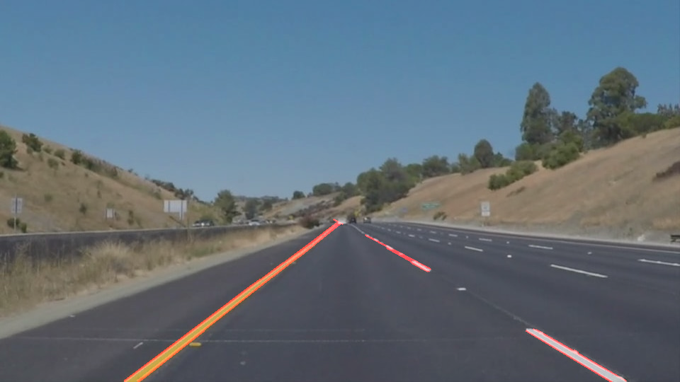
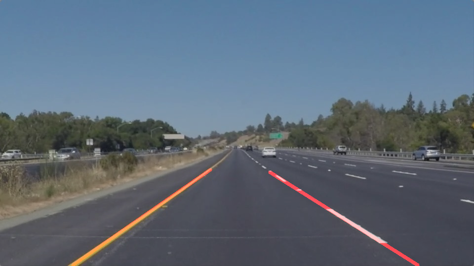

# **Finding Lane Lines on the Road** 

Overview
---

The goals of this project are the following:
* Make a pipeline that finds lane lines on the road
* Reflect on your work in a written report

Contents
---
There are three parts to the reflection:

1. Describe the pipeline

2. Identify any shortcomings

3. Suggest possible improvements

The Project
---

### Reflection

### 1. My pipeline. As part of the description, explain how you modified the draw_lines() function.

My pipeline consisted of 7 steps. 

Step1  Read in an image

Step2  Applies the Grayscale transform

Step3  Applies a Gaussian Noise kernel

Step4  Applies the Canny transform

Step5  Create an polygon and use it to apply an image mask

Step6  Returns an image with hough lines drawn

Step7   Get the result image and save it

In order to draw a single line on the left and right lanes, I modified the draw_lines() function.
1. Filter lines from hough-transfered lines. Give up the lines whose absolute slope is too big or too small.
2. Solve the slope of to classify the lines.
3. Calculate the length of every line as the weight to solve the average slope and average x and y coordinate.
4. Based the equation y = m * x + b, solve the b value.
5. Find the maximum and minimum y value,then using it to solve corresponding x value to decide the endpoints of left line and right line.

The output looks like as follow:

### 2. Potential shortcomings

Because i use four points which cannot be self-adjustmented as corner points of polygon, so when the picture's shape changes, 

the polygon may not include the lane to be detected.

### 3. Suggest possible improvements to your pipeline

A possible improvement would be to that the polygon can adjust its shape based on the picture's size and the position of lanes.

